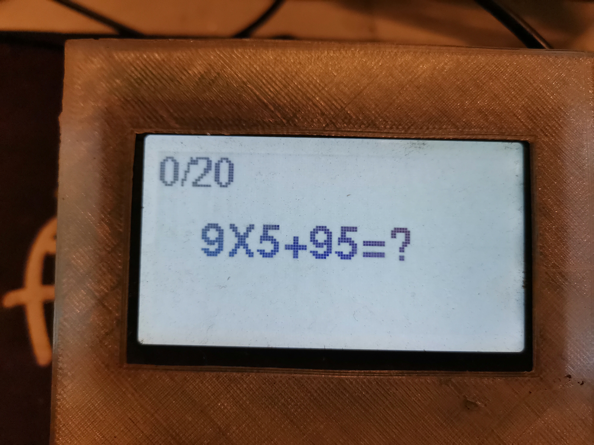
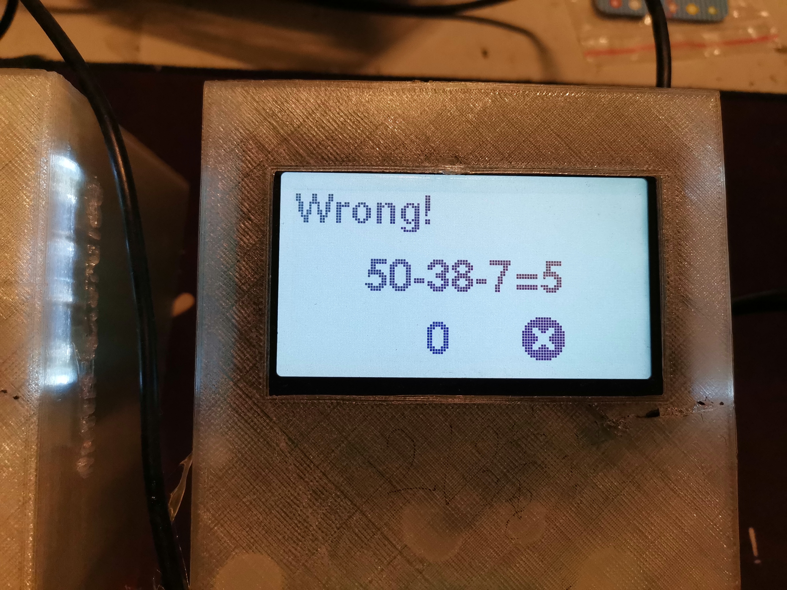
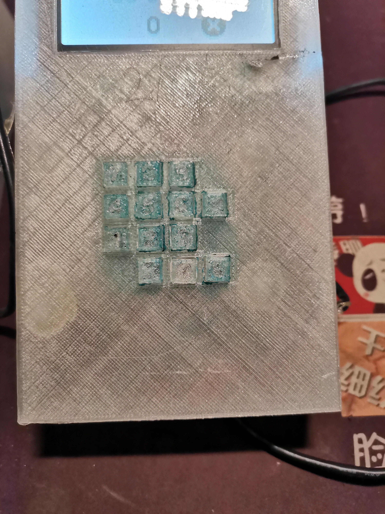
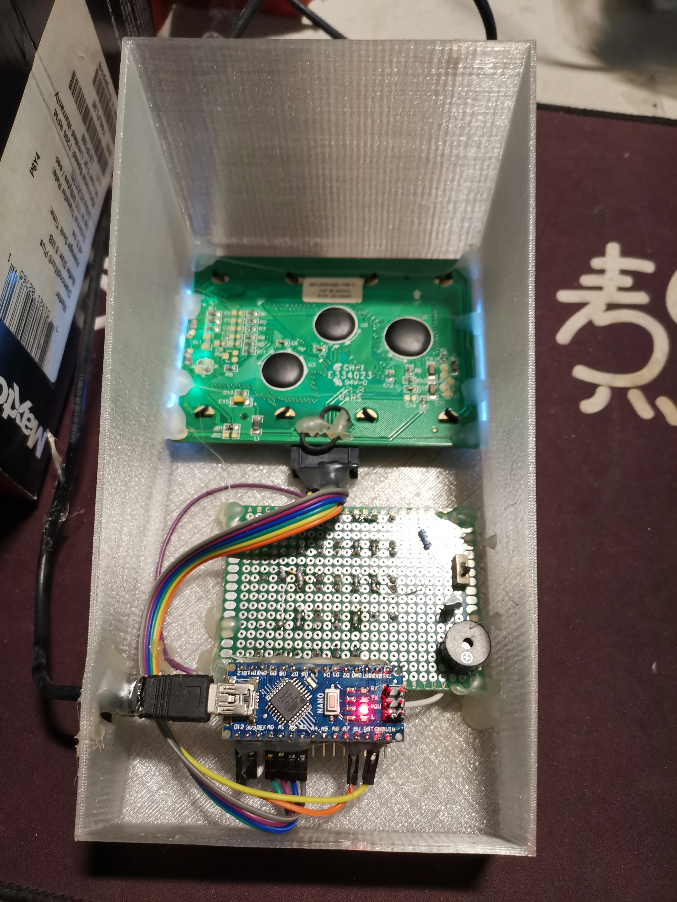
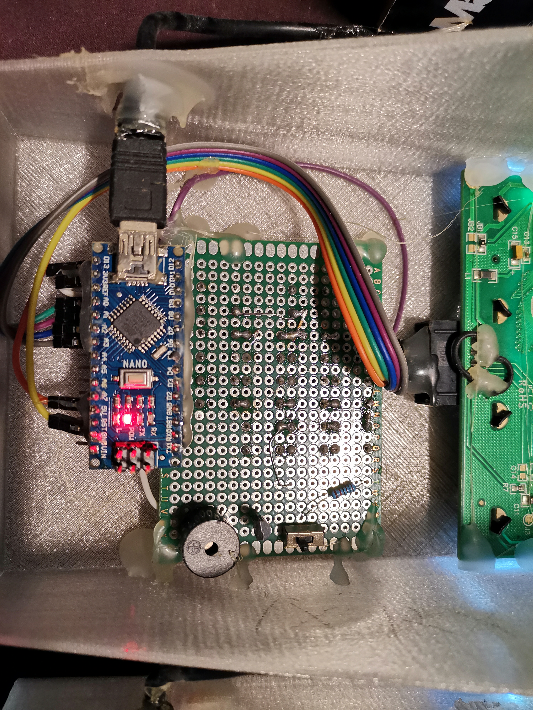

# Nano-MathToyMix100-12864

An Arduino Nano math-practice toy for kids: a 13-button numeric keypad (0-9,
decimal point, and two function keys) plus a 128x64 SPI LCD generate and
grade a mix of addition/subtraction/multiplication/division questions.

 
 
 
 

## Hardware

See [Wiring.txt](Wiring.txt) for the LCD and keypad pin mapping.

## How it works

- The **A** key submits your typed answer and checks it against the current
  question (short beep for correct, a buzzing pattern for wrong - a wrong
  answer also resets the question counter back to "Wrong!").
- The **B** key acts as backspace while typing.
- After checking an answer, press **A** again to advance to the next
  question (20 per round, then it loops back to 1).

## Dependencies

- [U8g2](https://github.com/olikraus/u8g2) (Arduino Library Manager)
